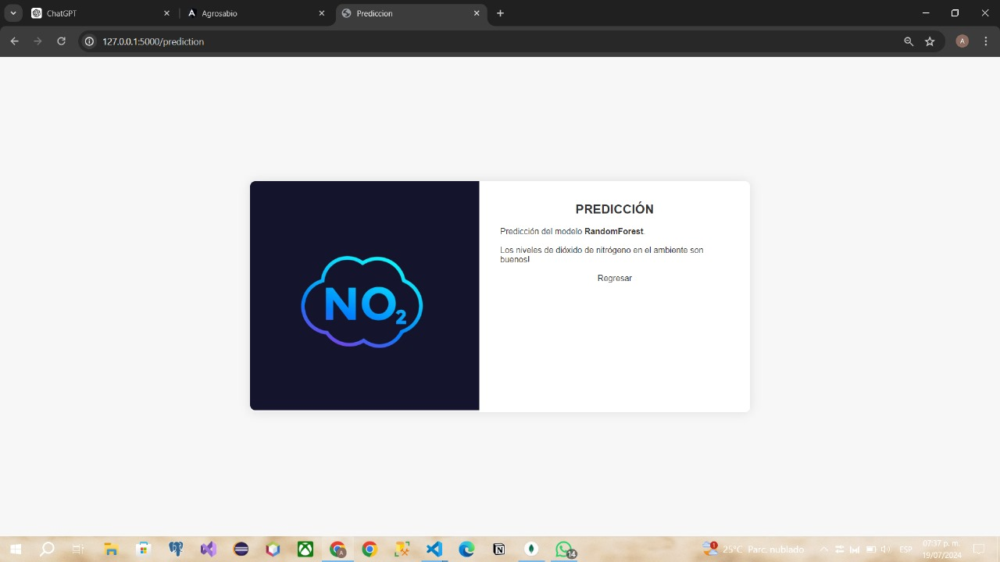

# Predicción de NO2 en el Ambiente - API REST

### Información del Servicio

El objetivo de este servicio es proporcionar una API REST para la predicción de los niveles de dióxido de nitrógeno (NO2) en el ambiente. Utilizando un modelo de Machine Learning basado en Random Forest, el servicio permite a los usuarios ingresar datos sobre los niveles de NO2 y recibir una predicción que indica si dichos niveles son peligrosos o no para la salud. 

El servicio se compone de dos páginas principales:
1. **Home Page**: Una interfaz gráfica donde los usuarios pueden introducir manualmente los datos de NO2 y enviar una solicitud para obtener una predicción.

2. **Prediction Page**: Una página que muestra el resultado de la predicción, basada en los datos ingresados por el usuario en la Home Page.

Esta API está diseñada para ser desplegada utilizando contenedores Docker, lo que facilita su distribución y ejecución en diferentes entornos sin preocuparse por inconsistencias en las dependencias del sistema.

### Requerimientos

Para utilizar este servicio, se necesita tener instalados los siguientes componentes:

- **Docker**: Docker es una plataforma de contenedorización que permite empaquetar y ejecutar aplicaciones en contenedores ligeros y portátiles.

Además, en un entorno de desarrollo, se recomienda tener instalados:

- **Python 3.9**: El lenguaje de programación en el que está escrito el servicio.
- **Flask**: Es un microframework para el desarrollo de aplicaciones web en Python.Su simplicidad y modularidad permiten a los desarrolladores crear aplicaciones desde prototipos rápidos hasta sistemas complejos y escalables. 
- **Pandas**: Es una biblioteca de Python que proporciona estructuras de datos y herramientas de análisis de datos de alto rendimiento y fácil de usar. Es esencial para tareas de manipulación y análisis de datos. 
- **Numpy**: Es una biblioteca de Python que proporciona un conjunto de herramientas para trabajar con matrices y vectores numéricos. 
- **Scikit-learn**: Es una biblioteca de Python que proporciona una amplia gama de algoritmos de aprendizaje automático, incluyendo clasificación, regresión, clustering y selección de características.
- **Joblib**: Eficiente de la serialización de objetos de Python y el paralelismo en la ejecución de tareas. 

### Instalación
Una vez teniendo el modelo entrenado y ya generado el archivo **model_TT_RFC.pkl** en su respectivo lugar se procede a instalar este servicio, siga los siguientes pasos:

#### Clonación del Repositorio

Primero, se debe clonar el repositorio del proyecto en la máquina local. Esto se puede hacer utilizando el siguiente comando:

\`\`\`sh
git clone <URL_DEL_REPOSITORIO>
cd ejemplo_flask
\`\`\`

Este comando descargará todos los archivos necesarios del repositorio y cambiará el directorio de trabajo al proyecto clonado.

#### Construcción de la Imagen Docker

Una vez clonado el repositorio, se debe construir la imagen Docker que contendrá toda la aplicación y sus dependencias. Para ello, se usa el siguiente comando:

\`\`\`sh
docker build -t mi-servidor-flask .
\`\`\`

Este comando le dice a Docker que construya una imagen utilizando el archivo \`Dockerfile\` en el directorio actual (indicado por el punto \`.\`) y etiquete esta imagen como \`mi-servidor-flask\`.

#### Ejecución del Contenedor Docker

Después de construir la imagen, se puede ejecutar un contenedor basado en esa imagen utilizando el siguiente comando:

\`\`\`sh
docker run -d -p 5000:5000 mi-servidor-flask
\`\`\`

Este comando ejecuta un contenedor en modo desatendido (\`-d\`), mapeando el puerto 5000 del contenedor al puerto 5000 de la máquina host. La aplicación estará disponible en \`http://localhost:5000\`.

### Uso (Producción)

#### Acceso a la Home Page

La página principal del servicio está disponible en \`http://localhost:5000\`. Aquí, los usuarios pueden ingresar el nivel de NO2 y enviar una solicitud de predicción.

#### Endpoint: \`/prediction\`

- **URL**: \`http://localhost:5000/prediction\`
- **Método**: POST
- **Parámetros**:
  - \`no2\`: Nivel de NO2 en el ambiente.

Este endpoint procesa la solicitud POST, utiliza el modelo de predicción para evaluar el nivel de NO2 ingresado y devuelve una predicción sobre si los niveles son peligrosos o no.

**Ejemplo de Solicitud con cURL**:

\`\`\`sh
curl -X POST http://localhost:5000/prediction -d "no2=45"
\`\`\`

En este ejemplo, se envía una solicitud POST al endpoint \`/prediction\` con un nivel de NO2 de 45. La respuesta será una página HTML que indica si los niveles de NO2 son peligrosos para la salud.

### Uso (Desarrollo)

#### Configuración del Entorno Virtual

Para configurar el entorno de desarrollo, se recomienda utilizar un entorno virtual. Esto asegura que las dependencias del proyecto no entren en conflicto con otras bibliotecas instaladas en el sistema.

1. **Crear un Entorno Virtual**:

   \`\`\`sh
   python -m venv venv
   source venv/bin/activate  # En Windows usa \`venv\Scripts\activate\`
   \`\`\`

2. **Instalar las Dependencias**:

   \`\`\`sh
   pip install -r requirements.txt
   \`\`\`

Este comando instalará todas las dependencias listadas en el archivo \`requirements.txt\`.

#### Ejecución de la Aplicación Flask

Una vez configurado el entorno virtual e instaladas las dependencias, se puede ejecutar la aplicación Flask utilizando el siguiente comando:

\`\`\`sh
python server_TT.py
\`\`\`

La aplicación estará disponible en \`http://localhost:5000\`.

### Archivos Importantes

- **server_TT.py**: Este es el archivo principal que contiene la lógica de la aplicación Flask. Define los endpoints y maneja las solicitudes HTTP.
- **template/index.html**: Plantilla HTML para la página principal del servicio.
- **template/prediccion.html**: Plantilla HTML para la página de predicción, donde se muestra el resultado.
- **columns_set.json**: Archivo JSON que define las columnas esperadas por el modelo.
- **model_TT_RFC.pkl**: Archivo que contiene el modelo de Random Forest preentrenado (no incluido en el repositorio por defecto, debe ser proporcionado por el usuario).

### Conclusión

Este README proporciona una guía completa y detallada para la instalación, configuración y uso del servicio REST API de clasificación de NO2. La utilización de Docker asegura que la aplicación se pueda desplegar fácilmente en cualquier entorno, mientras que las instrucciones detalladas para el desarrollo facilitan la colaboración y el mantenimiento del proyecto.
